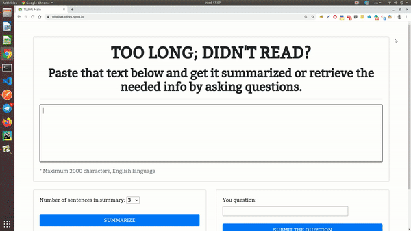

# Project "TL;DR" #

_"TL;DR" ("Too Long; Didn't read")_ project is a website which allows a user to paste an arbitrary text and:
* get it summarized to a given number of sentences or 
* get answers to the user's questions based on the text provided.

Text is summarized following extractive summarization approach using Natural Language Toolkit ([NLTK](https://www.nltk.org/)) and question answering is implemented using a pre-trained machine learning model [BERT](https://en.wikipedia.org/wiki/BERT_(language_model)), fine-tuned on the [SQuAD](https://rajpurkar.github.io/SQuAD-explorer/) benchmark.

Frontend: HTML/CSS-Bootstrap/JS.
Backend: Python/Flask.

Source code: https://github.com/IuriiD/nlp_bert_nltk

I created this app as my [final project](https://cs50.harvard.edu/x/2020/project/) in the [CS50](https://cs50.harvard.edu/x/2020/) course and as my first acquiaintance with BERT and NTLK.